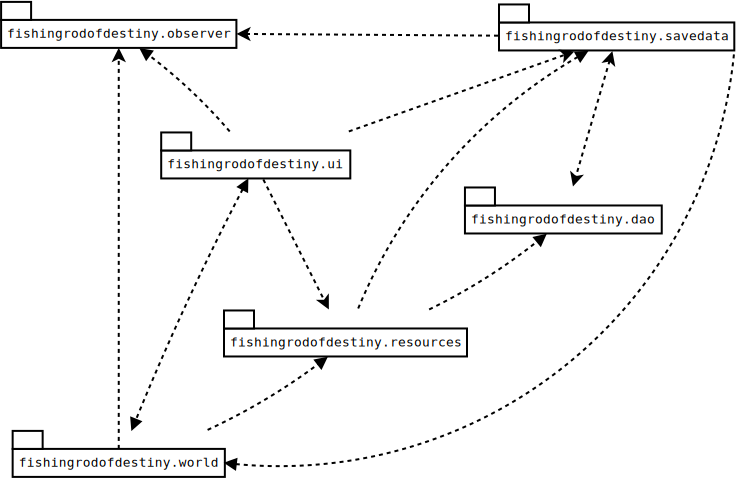

# Architecture of The Fishing Rod of Destiny

Basic architecture is shown below:

<table>
  <tr>
    <th>Package</th><th>Description</th>
  </tr>
  <tr>
    <td>fishingrodofdestiny.ui</td>
    <td>The user interface base</td>
  </tr>
  <tr>
    <td>fishingrodofdestiny.ui.screens</td>
    <td>The different screens (views) of the application.</td>
  </tr>
  <tr>
    <td>fishingrodofdestiny.ui.widgets</td>
    <td>Widgets used in the screens.</td>
  </tr>
  <tr>
    <td>fishingrodofdestiny.world</td>
    <td>The game world and its logic.</td>
  </tr>
  <tr>
    <td>fishingrodofdestiny.world.gameobjects</td>
    <td>Movable objects in the game, for example player, weapon.</td>
  </tr>
  <tr>
    <td>fishingrodofdestiny.world.tiles</td>
    <td>Static parts of the levels.</td>
  </tr>
</table>
