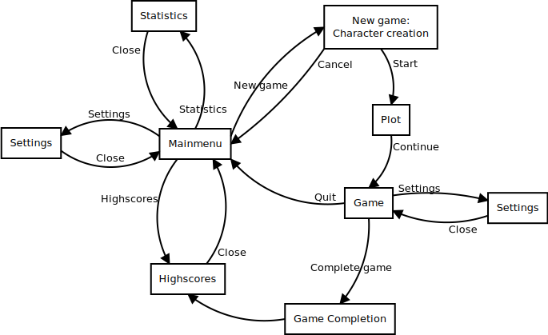

# Architecture of The Fishing Rod of Destiny

<div>Basic architecture is shown below:</div>
<div></div>

## Packages

List of all packages:

<table>
  <tr>
    <th>Package</th><th>Description</th>
  </tr>
  <tr>
    <td>fishingrodofdestiny.dao</td>
    <td>Data access objects and their support classes.</td>
  </tr>
  <tr>
    <td>fishingrodofdestiny.observer</td>
    <td>Helper classes to implement observer pattern.</td>
  </tr>
  <tr>
    <td>fishingrodofdestiny.resources</td>
    <td>Resource loading and saving caches, all caches use the singleton pattern.</td>
  </tr>
  <tr>
    <td>fishingrodofdestiny.savedata</td>
    <td>Data that are saved&loaded.</td>
  </tr>
  <tr>
    <td>fishingrodofdestiny.savedata.highscores</td>
    <td>Highscore handling. Each type of highscore has its own class containing the method to calculate the points for that particular type of highscore.</td>
  </tr>
  <tr>
    <td>fishingrodofdestiny.savedata.statistics</td>
    <td>Statistics about games played.</td>
  </tr>
  <tr>
    <td>fishingrodofdestiny.settings</td>
    <td>User settings (keyboard mapping etc).</td>
  </tr>
  <tr>
    <td>fishingrodofdestiny.ui</td>
    <td>The user interface base.</td>
  </tr>
  <tr>
    <td>fishingrodofdestiny.ui.screens</td>
    <td>The different screens (views) of the application.</td>
  </tr>
  <tr>
    <td>fishingrodofdestiny.ui.widgets</td>
    <td>Widgets used in the screens and windows.</td>
  </tr>
  <tr>
    <td>fishingrodofdestiny.ui.windows</td>
    <td>Windows used in the screens. For example a modal requester used to confirm if the player wants to quit the game.</td>
  </tr>
  <tr>
    <td>fishingrodofdestiny.world</td>
    <td>The game world and its logic.</td>
  </tr>
  <tr>
    <td>fishingrodofdestiny.world.actions</td>
    <td>Actions characters can perform, for example move and attack.</td>
  </tr>
  <tr>
    <td>fishingrodofdestiny.world.controllers</td>
    <td>Character controllers, used to determine the next action the controlled character should make.</td>
  </tr>
  <tr>
    <td>fishingrodofdestiny.world.gameobjects</td>
    <td>Movable objects in the game, for example player, weapon.</td>
  </tr>
  <tr>
    <td>fishingrodofdestiny.world.tiles</td>
    <td>Static parts of the levels.</td>
  </tr>
</table>


## User interface

The user interface is made of a number of *screens*, each defined in their own class in *fishingrodofdestiny.ui.screens* -package. The *screens* use both JavaFX widgets and custom widgets located in *fishingrodofdestiny.ui.widgets* -package, using the interface defined in the *Widget* -class. The class *UserInterfaceFactory* contains static methods to create common JavaFX widgets or a combination of them.

During an active on-going game, the user interface handles updating the screen based on events from the game and by querying the current state of it.

The user interface flow diagram:
<div></div>


## Application logic

Application logic is contained in the *fishingrodofdestiny.world* and its sub-packages. A single instance of a *Game* holds a single game and its state. A game contains a single cave (class *Cave*), and a reference to the player game object for ease of access / finding it.

The cave contains levels, and is responsible of setting up them. Level generators are used to generate the actual level layout, and the cave ties them together and places traps, items, enemies and such. The placing of items and enemies is based on rules defined in the levels using *GameObjectSpawner*. Traps and stairs are handled in cave because setting them up requires the knowledge of other levels.

A level defines (class *Level*) one section of the cave, and can be thought to be like a floor in a building, the player starts from the top floor and descends down to bottom floor (and then back up to the top floor). A level is made of 2d grid of adjacent tiles (class *Tile*), each tile having the exact same dimensions. The actual tile objects in the level are stored in a container class *LevelMap*.

A tile contains game objects (class *GameObject*), and game objects can contain other game objects. A game object is a movable object, whereas a tile is a static object. Certains types of tiles can have link to other tile, for example stairs down is connected to stairs up on another level.

<div></div>

The game advances when player picks the next action to be performed by the player character (class *Player*, instance of *GameObject*). The *tick()* method is called on the *Game* object, which in turn selects the levels to process, the selection is based on the location of the player character, only nearby levels are processed. The levels then call the *tick()* method of all of the game objects in the level, and the game objects do whatever they are destined to do. For example the player character might want to move one step to the east.

The game is controlled by the player, and is thus not realtime; the game is not progressing when the player is choosing the next action. This means that triggering the game to progress is done from the user interface. Also the initialization of the game is triggered from the user interface, be it starting a new game or loading a saved game.


### Game objects

The abstract GameObject class is the base class for all movable objects in the game. There are also several different abstract subclasses defined to group certain types of objects together:

* Character - a living creature (player and non player characters)
* Item - something that can be picked up
  * Armor - equippable items (for different slots)
  * Consumable - item that is consumed (destroyed) when used
  * Weapon - wieldable weapon

The following classes are used heavily by the game objects:

* Inventory - manages objects inside something (GameObject or Tile)
* LevelMemory - used by Player to keep track of what areas of the map are explored
* Location - manages moving objects between inventories


### Character controllers

Both the player character and non player characters are controlled by controllers. The controllers are attached to the characters, each having their own instance of a controller. Both the character and its controller know about each others.

Controllers create actions which are utilized in the owner game objects' *tick()* methods in their turn.

#### Player controller

The player controller uses input from the user (through JavaFX events) to determine the next action. More complicated actions may cause the player controller to show additional user interface controls on screen. For example, when player presses the key to pick up item when there are multiple items on the ground, the controller opens up an item chooser requester for the user to choose which item to pick up. After the user chooses the item, the appropriate action is created.

#### Non player controllers

The non player characters uses artificial intelligence to determine the next action.


### Actions

Actions are used to define an action a Character can perform. Each action is responsible of making sure the action is possible to perform, and alter the game state accordingly. Both the player and non player characters use the same actions.


### Monster hits player

The following sequence diagram describes what happens when a monster hits the player, and the player dies. The possible event listeners for onChange events are not shown, for the player this would be the CharacterStatus widget showing the players current status. Also the internal works of Location objects are not shown (which again for the players Location object would contain a triggered event, causing the LevelView to update).
<div></div>


## Datafiles

All the objects (and non player characters) are created with GameObjectFactory, which uses an [INI-file](https://en.wikipedia.org/wiki/INI_file) from `src/main/resources/fishingrodofdestiny/items.ini` to define the properties of each object.

Each object has its own section in the INI-file, the name of the section is used as an *object ID*. All object types share some common attributes, and some object types have additional attributes.

Example section in the INI-file describing the gold coin object:
```INI
[gold coin]
Type=ITEM
TileSet=rltiles/nh32
TileX=192
TileY=832
TileWidth=32
TileHeight=32
```

Example section in the INI-file describing a non player character (rat):
```INI
[rat]
Type=NPC
TileSet=rltiles/nh32
TileX=928
TileY=64
TileWidth=32
TileHeight=32
Controller=SimpleAiController
LevelMin=1
LevelMax=5
Attack=2
LevelAddAttack=1
LevelMulAttack=1
Defence=20
LevelAddDefence=1
LevelMulDefence=1
ArmorClass=5
LevelAddArmorClass=0.5
LevelMulArmorClass=1
Hitpoints=5
LevelAddHitpoints=2
LevelMulHitpoints=1
Regeneration=0
LevelAddRegeneration=0
LevelMulRegeneration=1
InventoryItemCountMax=0
LevelAddInventoryItemCountMax=1
LevelMulInventoryItemCountMax=1
InventoryItem=gold coin
InventoryItemMax=1
InventoryItemWeight=0.2
InventoryItem=kitchen knife
InventoryItemMax=1
InventoryItemWeight=0.3
InventoryItem=apple
InventoryItemMax=3
InventoryItemWeight=1
InventoryItem=potion of healing
InventoryItemMax=1
InventoryItemWeight=0.1
InventoryItem=potion of regeneration
InventoryItemMax=1
InventoryItemWeight=0.1
```

Because this INI-file is an internal data file, it is assumed that it is flawless, and errors are reported by throwing exceptions.

The next sections describes all the attribute groups.


### Common attributes

These attributes are used by all types of objects.

* `Type` = type of the object, valid values are: ARMOR, CONSUMABLE, ITEM, NPC, OBJECT, WEAPON

Object types and their additional attribute groups:
<table>
  <tr><th>Type</th>      <th>Attribute groups</th></tr>
  <tr><td>ARMOR</td>     <td>Basic, Gfx, Buffs, Armor</td></tr>
  <tr><td>CONSUMABLE</td><td>Basic, Gfx, UseBuffs, Consumable</td></tr>
  <tr><td>ITEM</td>      <td>Basic, Gfx, UseBuffs</td></tr>
  <tr><td>NPC</td>       <td>Basic, Gfx, Level, InventoryItems</td></tr>
  <tr><td>OBJECT</td>    <td>Basic, Gfx</td></tr>
  <tr><td>WEAPON</td>    <td>Basic, Gfx, Buffs, Weapon</td></tr>
</table>


### Basic attributes

* `Hitpoints`
* `TimeToLive`
* `Weight`

### Gfx attributes

These define the visual representation of the object.

* `TileSet` 
* `TileX`
* `TileY`
* `TileWidth`
* `TileHeight`

### Buffs attributes

These define the permanent buffs tied to the object.

* `BuffType`
* `BuffAmount`

### UseBuffs attributes

These define the buffs added to the user of the item.

* `BuffType`
* `BuffTime`
* `BuffAmount`

### Consumable attributes

* `UseVerb`
* `HealOnUse`
* `HealOnUse%`

### Weapon attributes

* `Damage`
* `ChanceToHitMultiplier`

### Armor attributes

* `Slot`

### Level attributes

These are for non player characters only, and define the character level and other Character only attributes.

* `LevelMin`
* `LevelMax`
* `Hitpoints`
* `LevelAddHitpoints`
* `LevelMulHitpoints`
* `Attack`
* `LevelAddAttack`
* `LevelMulAttack`
* `Defence`
* `LevelAddDefence`
* `LevelMulDefence`
* `ArmorClass`
* `LevelAddArmorClass`
* `LevelMulArmorClass`
* `Regeneration`
* `LevelAddRegeneration`
* `LevelMulRegeneration`


### InventoryItems attributes

These define inventory items to be added using GameObjectSpawner.

* `InventoryItemCountMax`
* `LevelAddInventoryItemCountMax`
* `LevelMulInventoryItemCountMax`

The following group can be defined multiple times:

* `InventoryItem`
* `InventoryItemMax`
* `InventoryItemWeight`


## Saved data

[Data access objects](https://en.wikipedia.org/wiki/Data_access_object) are used to handle the details about saving and loading. There are three different choices for saving the data: database, files, or in memory.

The default is to use a SQLite database named *FishingRodOfDestiny.db*. This can be changed via environment variables, see the [manual](manual.md) for details.

Database operations use a *JdbcHelper* class which handles the low level database operations.


### Highscores

#### Highscores in database

Highscores are saved on a table named *Highscores*:
```SQL
CREATE TABLE Highscores (
  highscore_id   INTEGER PRIMARY KEY AUTOINCREMENT,
  highscore_type VARCHAR(40) NOT NULL,
  name           VARCHAR(80) NOT NULL,
  points         INTEGER     NOT NULL,
  game_ended     DATETIME    NOT NULL
);
```
The field *game_ended* is on local time.

#### Highscores in files

When using files to save highscores, each type of highscore is saved in their own file.
A highscore entry is split into 3 lines:
```
name
points
game_ended
```


### Statistics

#### Statistics in database

Statistics are saved on a table named *Statistics*:
```SQL
CREATE TABLE IF NOT EXISTS Statistics (
  games_played    INTEGER(8) NOT NULL,
  games_completed INTEGER(8) NOT NULL,
  gold_collected  INTEGER(8) NOT NULL,
  enemies_killed  INTEGER(8) NOT NULL
)
```

#### Statistics in a file

Statistics are saved one value per line:
```
games_played
games_completed
gold_collected
enemies_killed
```
