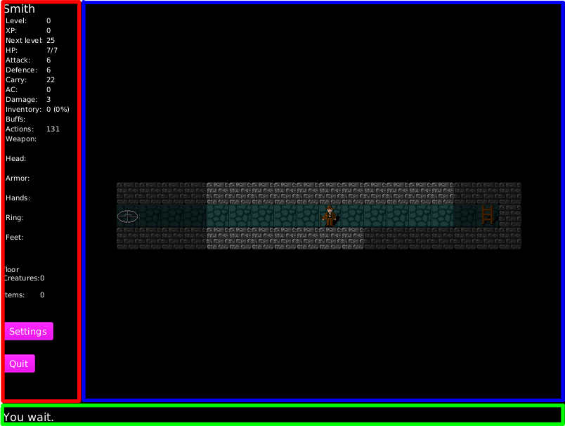

# The Fishing Rod of Destiny user manual

## Starting the game

Fishing Rod of Destiny requires Java 8 with JavaFX.

Assuming that the default Java is of proper version, the game can be run by executing the release package with
```java -jar release.jar```
Or straight from the source distribution with
```mvn compile exec:java -Dexec.mainClass=fishingrodofdestiny.ui.FishingRodOfDestinyUi```

## Playing

From the main menu, player can start a new game, see highscores, see statistics, change settings, or quit the game. In addition to using the mouse, also the cursor keys and tabulator key can be used to move between the buttons, and spacebar can be used to select.

### New game

Player must input a name for player character, and additionally make other choices that affect the game, only the name is mandatory.

The player is given certain number of points to distribute among the player character attributes, the choice of either rescuing a princess or a prince.

A seed number can be given to the random game generator, same seed number will always give the same game experience (cave levels, locations of creatures, traps, and other things). The generator is often changed between different versions of the game, and thus the guarantee of getting same experience with a certain seed number does not necessarily work between different versions of the game.

### In game

The game screen is split in three major parts. On the left side are shown player statistics and other information (the red area on the image below), on the right side is the view of the current level (the blue area on the image below), and at the bottom is a one line message (the green area on the image below). On the left side there are also two buttons, one to summon the settings window and another to quit the game, these buttons are only accessible with the mouse.



The game waits for the player to take an action, and then proceeds to simulate the environment, including the players character which will execute the issued action.

The goal of the game is to reach the bottom of the cave, obtain a fishing rod, and get back up and take the stairs leading out.

In addition to actions, player can adjust settings (keybindings), and zoom in/out the level view during the game.


#### Actions

Each turn, player and other characters decide the action they are going to take. The possible actions are listed below:
* wait          - Skip turn.
* move          - Move one step to north, south, west or east.
* activate tile - Perform a tile specific action. These include: using stairs, reactivating traps, and sacrificing gold on an altar.
* attack        - Attack whoever is in the same tile.
* pick up       - Pick an item from the floor.
* drop          - Drop an item to the floor. Can also be used as a "view inventory" if cancelled (doesn't consume the turn).
* use           - Use an item from the inventory. Each item has only one possible use. For example eat an apple, wear armor, wield weapon.
* level up      - Level up the player character (if the player has enough experience points).


#### Healing

Player, and some non-player characters, regenerate hit points over time. In addition to the regeneration system certain consumables and actions heal the character.


#### Combat

Combat is possible only within same tile. To attack a monster, move to their tile (or wait for them to move to your tile), and press the *attack* key.


#### Experience points and levelling the character up

The player character gains experience points from every kill. Once the player character has gained enough experience points, the player character can level up. This must be manually performed and it consumes a turn.

The amount of experience points required for the next level is displayed below the experience points in the player statistics portion of the screen.

Levelling up the character gives a random bonus to one of the attributes. The bonus amount is based on the character level number. The attribute type is chosen with a weighted randomizer, where the attributes that have been allocated more points are favored. For example, if the player puts all the points in the character creation screen into hit points the player character is more likely to level up hit points.


## Character attributes

The player and non-player characters have the following attributes:

* hit points - the health of the character, once hit points reach 0, the character dies
* maximum hit points - the maximum number of the hit points
* attack - adjusts the damage done per attack, and the chance to hit
* defence - adjusts the chance to avoid getting hit
* carrying capacity - the maximum weight of items that can be carried before movement is restricted
* armor class - adjusts the damage received per attack
* damage - calculated maximum damage that can be done with an attack
* experience points - experience points gained, after gaining enough experience points, the next level can be unlocked
* level - the level of the character, every increase in level gives additional bonuses to some character attribute


## Configuration

### Highscores

By default the highscores are saved in a SQLite database named *FishingRodOfDestiny.db*. To change this, use the environment variable *FISHINGRODOFDESTINY_HIGHSCORES* to define the location as follows:

* Start with "jdbc:" to define a Jdbc database connection URI, for example: "jdbc:sqlite:FishingRodOfDestiny.db"
* Start with "file:" to define a filename base, for example "file:./highscores" will save the score based highscores to a file named *highscores-Score*. Each type of highscores are saved in their own file.
* Start with anything else to use in memory highscores that are not saved anywhere.

### Statistics

Statistics are saved similarly to highscores. The controlling environment variable is named *FISHINGRODOFDESTINY_STATISTICS*.


### Settings

Settings are saved similarly to highscores and statistics. The controlling environment variable is named *FISHINGRODOFDESTINY_SETTINGS*.

When using a file, the format is a [INI-file](https://en.wikipedia.org/wiki/INI_file).

For keyboard settings, the file contains section named "keyboard", with mappings from keys to action/command.
The keys are named after [JavaFX enum KeyCode](https://docs.oracle.com/javase/8/javafx/api/javafx/scene/input/KeyCode.html), and the actions/commands are listed below:

Actions:
* WAIT          - Skip turn.
* MOVE_NORTH    - Move north.
* MOVE_SOUTH
* MOVE_WEST
* MOVE_EAST
* ACTIVATE_TILE - Tile specific action.
* ATTACK        - Attack whoever is in the same tile.
* PICK_UP       - Pick an item from the floor.
* DROP          - Drop an item to the floor.
* USE           - Use an item from the inventory.
* LEVEL_UP      - Level up the player character (if the player has enough experience points).

Commands:
* ZOOM_IN       - Zoom the level map view in (make things look bigger).
* ZOOM_OUT      - Zoom the level map view out (make things look smaller).
* EXIT          - Exit the game.

Example of a settings file:
```INI
[keyboard]
# Actions
UP=MOVE_NORTH
DOWN=MOVE_SOUTH
LEFT=MOVE_WEST
RIGHT=MOVE_EAST
E=ACTIVATE_TILE
A=ATTACK
W=WAIT
P=PICK_UP
D=DROP
U=USE
L=LEVEL_UP
# Commands
PAGE_DOWN=ZOOM_IN
PAGE_UP=ZOOM_OUT
ESCAPE=EXIT
```


#### Default keyboard settings

* `up/down/left/right` to move
* `a` to attack enemies in same tile
* `e` to activate tile
* `page up` to zoom out
* `page down` to zoom in
* `w` to wait
* `p` to pick up items
* `d` to drop items
* `u` to use items
* `l` to level up the character
