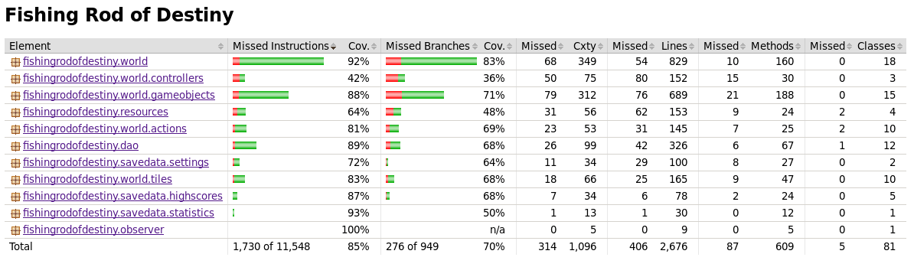

# Testing

The software has been tested with JUnit tests, consisting both unit and larger integration tests. Manual testing has also been done by using the software as a user, and playing the game.

The test coverage report has been used to track down yet untested portions of the software, some tests have been written while fixing bugs, and some tests have been written in advance or simultaneously while working on the actual code base.

All the testing have been done in a Linux system.

## Test coverage

Test coverage report is generated using Jacoco-maven plugin. User interface code, in *fishingrodofdestiny.ui* and its child packages have been excluded from the test coverate report.

The test coverage looks like the following on git commit `d07b36da2f2ccec0fa2facf4f5a443c01c02c142`:

A big portion of code that is not covered by tests contain methods that do drawing, and methods that use the user interface (for example player controller). Also a lot of the error conditions are left untested, for example the code in GameObjectFactory that loads the *items.ini* -file containing the GameObject definitions is assumed to be flawless as it is not changeable by normal user, and thus tests, which would test the code path that is executed when the *items.ini* is broken, have largely not been implemented.

The game have been played through (ie. completed) multiple times during the tests, although decreasingly often as development has progressed forward, because the game has become harder to complete.
